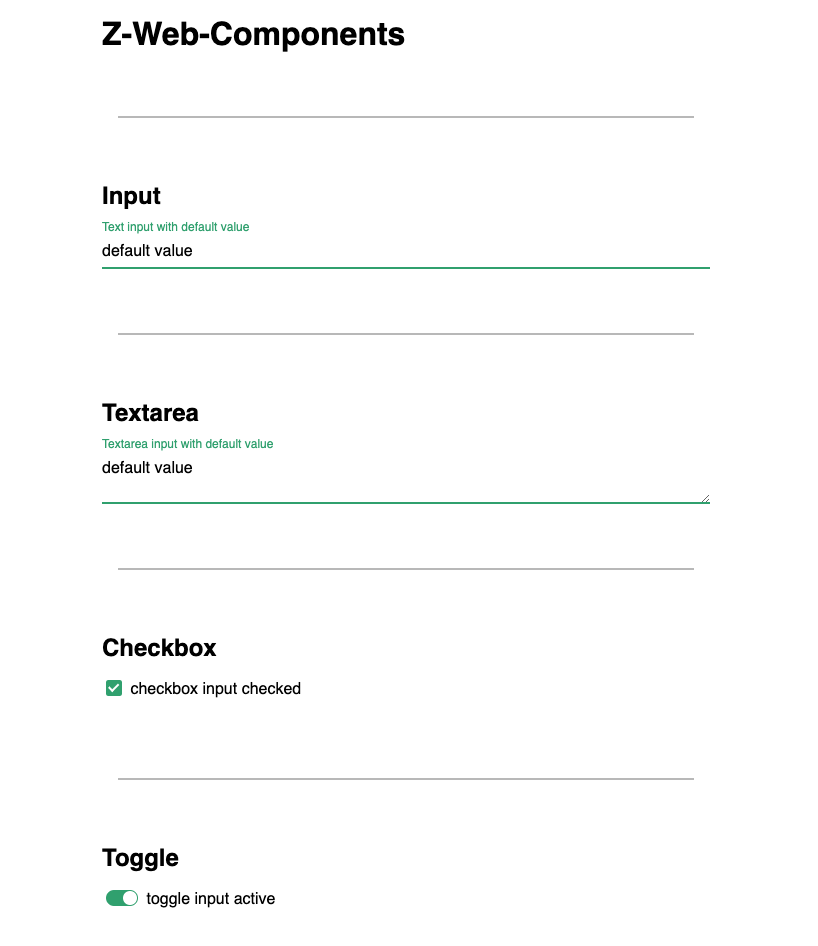

# Z WebComponents

A set of web components I'd like to use more often...

[](https://app.netlify.com/sites/z-web-components/deploys)

[DEMO](https://z-web-components.netlify.com/)

<details>
    <summary>Click for screenshot</summary>
    
</details>

## Getting Started

First install the lib in your project

```bash
npm i z-web-components
```

Then import what you need

```js
// main.js
import { ZInput, ZTextArea, ZCheckbox, ZToggle, ZRadioGroup, ZRadio } from "./z-web-components"

customElements.define('z-input', ZInput)
customElements.define('z-textarea', ZTextArea)
customElements.define('z-checkbox', ZCheckbox)
customElements.define('z-toggle', ZToggle)
customElements.define('z-radio-group', ZRadioGroup)
customElements.define('z-radio', ZRadio)
```

And use it in your html

```html
<!-- index.html -->
<z-input label="Text input with default value" value="default value"></z-input>

<z-textarea label="Textarea input with default value" value="default value"></z-textarea>

<z-checkbox label="checkbox input checked" checked></z-checkbox>

<z-toggle label="toggle input active" active></z-toggle>

<z-radio-group name="radio-demo" value="2">
    <z-radio label="radio input" value="1"></z-radio>
    <z-radio label="radio input" value="2"></z-radio>
</z-radio-group>
```

### Prerequisites

The Z Web Components should work on these browsers:

```json
"browserslist": [
    ">2%",
    "Edge > 14",
    "Firefox > 63",
    "Chrome > 67"
]
```

## Built With

* [ParcelJs](https://parceljs.org/) - Blazing fast, zero configuration web application bundler
* [LitElement](https://lit-element.polymer-project.org/) - A simple base class for creating fast, lightweight web components

## Contributing

Please read [CONTRIBUTING.md](CONTRIBUTING.md) for details on our code of conduct, and the process for submitting pull requests to us.

### Development

Clone the repository

```bash
# ssh
git clone git@github.com:benavern/z-components.git z-web-components

# https
git clone https://github.com/benavern/z-components.git z-web-components
```

Install dependancies

```bash
cd z-web-components
npm i
```

Serve with hot reload and stuff

```bash
npm run dev
```

Build the lib

```bash
npm run build:lib
```

## Versioning

We use [SemVer](http://semver.org/) for versioning.

We use gitflow for development workflow.

## Authors

* **Benjamin Caradeuc** - *Initial work* - [benavern](https://github.com/benavern)

See also the list of [contributors](https://github.com/benavern/z-components/contributors) who participated in this project.

## License

This project is licensed under the MIT License - see the [LICENSE.md](LICENSE.md) file for details
